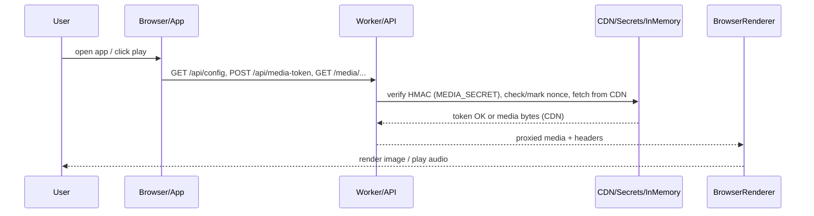

1. The Architecture Map:



2. The 'Skeleton Closet':

- `MEDIA_SECRET` fallback ('please-set-a-strong-secret-in-prod') in `functions/_middleware.js` and `functions/api/media-token.js` — a development default that silently weakens HMAC verification if the secret isn't set; attackers with token access can forge tokens if deployment missed the secret.
- In-memory single-use token store `globalThis.__USED_MEDIA_TOKENS` (Map) — non-durable, recycled on worker restart, and leaks state across tenants in long-lived instances; will allow reuse/duplication after a crash or worker migration.
- Token design: token lifetime = 60s and binding to IP+UA-hash — fragile for mobile/proxy networks; UA hashing uses first 8 hex chars (high collision risk) and strict IP match breaks clients behind changing proxies/CDNs.
- Crypto encoding inconsistencies: `toBase64Url(enc.encode(payloadJson))` vs `fromBase64Url` and reliance on `btoa/atob` with raw UTF-8 bytes — cross-runtime encoding mismatch risk (node vs browser vs worker) that can make signature verification fail intermittently.
- Hard-coded CDN and jsDelivr URLs in `functions/_middleware.js` and `src/core/app.js` (multiple places) — a brittle single upstream; if the GitHub repo path or branch changes the app silently breaks.
- Guest-lockdown allowlist (array of hard-coded paths in `_middleware.js`) — any needed static asset not present in that exact list will 404 for non-premium users; small UI change may break landing page assets.
- `functions/login-google.js` intentionally skips real token verification ("We don't check the token") — hitting this endpoint grants `TUWA_PREMIUM=true` cookie unconditionally.
- `functions/login-client.js` contains `alert(...)` debug UX and forces a hard reload — noisy and blocks automated flows; also shows a visible debug path for native login.
- `encodeStream` / `decodeStream` base64-url scheme in `src/core/app.js` — custom tokenization for deep-links with no signature, easily forged if an attacker knows the format (it only encodes the values, no HMAC).
- `canonical` link uses hard-coded domain `https://Quran-lite.pages.dev/reading/` — will generate incorrect canonical URLs in previews if domain changes.
- `updateTranslationAudio()` is a stub (returns immediately) — translation audio behavior is incomplete; UI expects it and edge cases silently fail.
- Several `SECURE FIX` comments indicate past quick fixes; they often replaced proper access controls with tunnel requests — complexity lives in coordination between client tunnel calls and middleware validation.
- `FTT_URL` and forbidden-to-translate logic loaded from an external XML (FTT.XML) — if that upstream is missing or malformed the forbidden list won't load and protected verses may be shown or translation placeholders break layout.
- Multiple DOM assumptions: heavy reliance on specific element IDs/classes (e.g., `#door-hero-img`, `#preview-audio`, `#all-row`) — missing or renamed elements will throw and break navigation.
- `env.ASSETS.fetch(...)` usage — worker assumes Cloudflare `ASSETS` binding; running outside CF Pages/Workers without binding will crash routing.
- `preview`/`smartSeek` logic keeps `pendingSeekOffset` and manipulates audio across chapter boundaries — fragile timing; seek across chapters risks race conditions and state mismatch.
- Hard-coded cookie name `TUWA_PREMIUM=true` and Max-Age in `login-google.js` — auth gating is cookie-string dependent and not tied to signed sessions.

3. Critical File Index:

- `src/core/app.js`: The client-side single-page controller — loads config, manages UI state, tunnels media requests, and orchestrates playback.
- `functions/_middleware.js`: Edge gatekeeper — routes landing vs app, enforces premium gating, validates media tokens, proxies CDN media and whitelists guest assets.
- `functions/api/media-token.js`: Token minting endpoint — creates short-lived HMAC-signed tokens bound to IP/UA for the media tunnel.
- `functions/api/config.js`: Central config endpoint — serves SURAH metadata, translations config and reciters (the hidden authoritative metadata client relies on).
- `src/core/lyrics-engine.js`: Lightweight display engine — renders current + next translation lines and is tightly coupled to the app's translation flow.

4. Environment & Secrets:

- `MEDIA_SECRET` (required): HMAC secret used to sign/verify `/api/media-token` tokens — set as a secret in the Cloudflare Worker / Pages environment. Obtain from deployment vault or generate a high-entropy secret (32+ bytes) and set via `wrangler secret put MEDIA_SECRET`.
- `ASSETS` (required binding): Cloudflare Pages/Worker asset binding used as `env.ASSETS.fetch(...)` — ensure your Pages/Workers deployment binds the static assets under this name.
- `CLOUDFLARE_ACCOUNT_ID` and `CLOUDFLARE_API_TOKEN` (required for deploy/dev): used by `wrangler` when running `npm run dev` / deploy; get from Cloudflare dashboard (API tokens with appropriate permissions).
- `TUWA_PREMIUM` (cookie name): not a secret but a runtime auth artifact — the app trusts the `TUWA_PREMIUM=true` cookie as the premium flag (settable by `login-google` endpoint).

5. Emergency Revival:

Note: there is no persistent application database in this repo — token nonces are in-memory. For production using KV/Redis, follow your provider's reset commands. Below are exact terminal steps to get a clean local/dev server and redeploy.

Windows PowerShell (exact commands):

```powershell
# 1) Clean local deps and artifacts
Remove-Item -Recurse -Force node_modules
Remove-Item -Force package-lock.json

# 2) Install dependencies
npm install

# 3) Start local Pages dev (requires wrangler auth + ASSETS binding)
npm run dev

# 4) If you must force-reset production token state, redeploy the worker (this redeploy clears runtime globals)
npm run deploy
```

Unix / Git Bash (exact commands):

```bash
# 1) Clean local deps and artifacts
rm -rf node_modules package-lock.json

# 2) Install dependencies
npm install

# 3) Start local Pages dev
npm run dev

# 4) Redeploy to reset worker globals / clear in-memory state
npm run deploy
```

Quick 3AM remediation checklist (short):

- If playback fails: redeploy (`npm run deploy`) to clear worker runtime; verify `MEDIA_SECRET` is set.
- If tokens failing to verify: confirm `MEDIA_SECRET` matches the deployed secret and the client fetches new tokens (1-minute TTL).
- If non-premium users see 404s: check `_middleware.js` allowlist and add the missing asset path.
- If login is granting premium unexpectedly: disable or fix `functions/login-google.js` (it currently auto-issues `TUWA_PREMIUM=true`).
